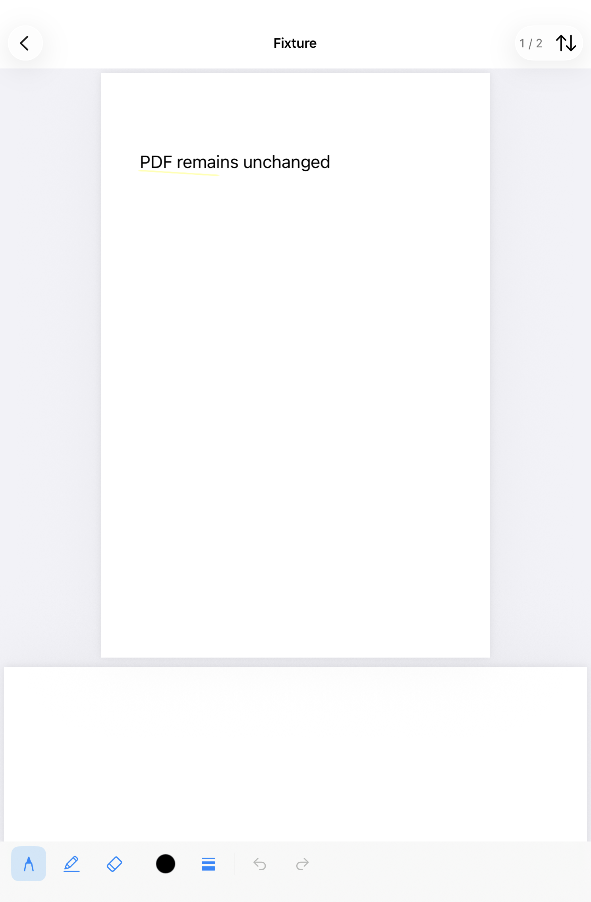

# 줄긋기 — PDFUnderliner

PDF 위에 Apple Pencil로 자유롭게 선을 그으며 읽는 개인용 iPad 앱입니다. PDF 원본은 바꾸지 않고 그리기 기록만 별도 파일에 자동 저장합니다.

## iPad mini 5에 설치

- iPadOS 16 이상이 필요합니다. iPad mini 5는 [Apple Pencil 1세대](https://support.apple.com/en-az/111904)를 지원합니다.
- `PDFUnderliner.xcodeproj`를 Xcode에서 열고 `PDFUnderliner` 스킴을 선택합니다.
- 앱 타깃의 **Signing & Capabilities → Team**에서 본인 Apple 계정을 선택합니다. Bundle Identifier는 필요하면 본인만의 값으로 바꿉니다.
- iPad mini 5를 Mac에 연결하고 실행 대상으로 선택합니다. 기기에서 필요한 개발자 모드와 개발자 신뢰를 허용한 뒤 **Run**으로 설치합니다.
- 실행된 앱에서 **PDF 가져오기**를 누릅니다. iCloud Drive의 파일도 파일 선택기로 가져올 수 있지만, 가져온 뒤에는 앱 내부의 로컬 복사본을 사용합니다.

이 저장소에는 서명용 Team이나 인증서가 포함되어 있지 않습니다.

## 사용

- Pencil로 그리기, 손가락으로 이동, 두 손가락으로 확대합니다.
- 세로 연속 스크롤이 기본입니다. 우측 상단 읽기 방식 메뉴에서 한 페이지씩 가로로 넘기도록 변경할 수 있습니다.
- 하단에서 펜·형광펜·획 지우개를 선택합니다. 색상과 3단계 굵기는 펜과 형광펜 각각 기억합니다. 작은 창에서는 도구 모음을 가로로 스크롤합니다.
- 실행 취소·다시 실행은 현재 페이지에 적용합니다. 페이지별 최근 20개 변경을 문서를 연 동안 기억합니다.
- 문서 목록으로 돌아갔다가 다시 열면 마지막 읽던 위치로 이동합니다.
- 저장 오류가 나타나면 **재시도**합니다. 실패한 변경은 메모리에 유지되고, 저장에 성공하기 전에는 목록으로 돌아가지 않습니다. 저장 오류가 있는 상태에서 앱을 강제 종료하면 아직 저장되지 않은 변경은 잃을 수 있습니다.
- 그리기 파일이 손상되거나 없어지면 PDF를 읽기 전용으로 열고 기존 파일을 덮어쓰지 않습니다.
- 목록의 문서를 왼쪽으로 밀거나 길게 눌러 삭제할 수 있습니다. 확인 후 앱 내부 PDF와 기록만 삭제하며 파일 앱의 원본은 유지합니다.

## 내부 구조

외부 라이브러리는 사용하지 않습니다. SwiftUI + PDFKit 페이지 오버레이 + PencilKit으로 구성했습니다.

```
Application Support/Documents/<UUID>/
  source.pdf         원본 바이트 그대로 복사한 PDF
  annotations.plist  형식 버전, UUID, PDF SHA-256, 페이지 수, 페이지별 PKDrawing 바이너리
  metadata.plist     문서 제목, 최근 열기 시각, 페이지·PDF 좌표로 저장한 읽던 위치
```

도구와 읽기 방식 설정은 UserDefaults에 보관합니다. 그리기 파일에는 PDF나 페이지 이미지를 포함하지 않으므로, 크기는 실제 획의 양에 따라 늘어납니다. 자동 저장은 단일 큐에서 원자적으로 파일을 교체합니다. 미래의 동기화 구현을 위한 식별 정보만 두었으며 동기화·내보내기·백업 가져오기는 구현하지 않았습니다.

## 빌드와 테스트

저장 로직은 Mac에서 실행할 수 있습니다.

```sh
swift test
```

앱과 iOS 테스트의 시뮬레이터용 컴파일:

```sh
xcodebuild -project PDFUnderliner.xcodeproj -scheme PDFUnderliner \
  -destination 'generic/platform=iOS Simulator' \
  -derivedDataPath build/DerivedData CODE_SIGNING_ALLOWED=NO build-for-testing
```

실행 가능한 iPad 시뮬레이터 런타임이 설치되어 있으면 Xcode에서 iPad를 실행 대상으로 선택한 뒤 **Product → Test**로 PencilKit 왕복 저장·페이지별 실행 취소·손상 파일 보호·저장 실패 복구·캔버스 좌표 테스트를 실행합니다. 현재 Xcode의 XCTest 지원에 맞춰 테스트 타깃은 iOS 17 이상이며, 앱 자체는 iOS 16 이상입니다. 자동 테스트는 손가락/Pencil 입력의 실제 충돌이나 mini 5의 성능을 대신 확인하지 않습니다.

실제 기기 확인 항목은 `VALIDATION.md`에 있습니다.

Mac 저장 테스트 9개와 iOS 26.5 iPad mini 시뮬레이터 테스트 10개가 통과했습니다. 시뮬레이터에서 캡처한 화면:


